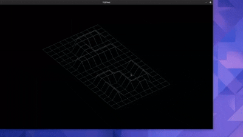

# FDF (Fil de Fer)



A 3D wireframe mesh viewer that renders height maps using isometric, perspective, and top-down projections. Built with [MLX42](https://github.com/codam-coding-college/MLX42), a modern cross-platform graphics library.

## Supported Platforms

| Platform | Status |
|----------|--------|
| macOS (Intel) | ✅ Supported |
| macOS (Apple Silicon M1-M5) | ✅ Supported |
| Linux (X11) | ✅ Supported |
| Windows (WSL) | ✅ Supported |

## Prerequisites

You only need **CMake** and a C compiler. All other dependencies are downloaded automatically.

<details>
<summary><b>macOS</b></summary>

```bash
# Install Xcode Command Line Tools
xcode-select --install

# Install Homebrew (if not installed)
/bin/bash -c "$(curl -fsSL https://raw.githubusercontent.com/Homebrew/install/HEAD/install.sh)"

# Install CMake
brew install cmake
```
</details>

<details>
<summary><b>Linux (Debian/Ubuntu)</b></summary>

```bash
sudo apt-get update
sudo apt-get install build-essential cmake git
```
</details>

<details>
<summary><b>Linux (Fedora)</b></summary>

```bash
sudo dnf install gcc make cmake git
```
</details>

<details>
<summary><b>Linux (Arch)</b></summary>

```bash
sudo pacman -S base-devel cmake git
```
</details>

## Quick Start

```bash
# Clone the repository
git clone https://github.com/adshz/fdf.git
cd fdf

# Build (automatically downloads all dependencies)
make

# Run
./fdf maps/42.fdf
```

## Build Commands

| Command | Description |
|---------|-------------|
| `make` | Build the project |
| `make run` | Build and run with default map |
| `make clean` | Remove object files |
| `make fclean` | Remove all build artifacts |
| `make re` | Rebuild from scratch |
| `make mrproper` | Full clean including dependencies |
| `make info` | Show build configuration |

## Controls

| Key | Action |
|-----|--------|
| `ESC` | Exit |
| `W` `A` `S` `D` | Move camera |
| `↑` `↓` `←` `→` | Rotate view |
| `Page Up/Down` | Zoom in/out |
| `=` / `-` | Line thickness |
| `I` | Isometric view |
| `P` | Perspective view |
| `T` | Top-down view |
| `Space` | Toggle colors |
| `R` | Reset view |

## Map Format

Maps are text files with height values. Optional hex colors can be added.

```
0  0  0  0  0
0  5  5  5  0
0  5 10  5  0
0  5  5  5  0
0  0  0  0  0
```

With colors:
```
0,0xFF0000  0,0x00FF00  0,0x0000FF
```

Sample maps are in the `maps/` directory.

## Project Structure

```
fdf/
├── src/
│   ├── main.c
│   └── modules/
│       ├── ft_colour/      # Color gradients
│       ├── ft_init/        # Initialization
│       ├── ft_interact/    # Input handling
│       ├── ft_parse/       # Map parsing
│       ├── ft_render/      # Bresenham line drawing
│       ├── ft_transform/   # 3D projections
│       └── ft_utils/       # Utilities
├── inc/                    # Headers
├── maps/                   # Sample maps
├── MLX42/                  # Graphics lib (auto-downloaded)
├── glfw/                   # Window lib (auto-downloaded)
├── libft/                  # C library (auto-downloaded)
└── Makefile
```

## Troubleshooting

<details>
<summary><b>CMake not found</b></summary>

```bash
# macOS
brew install cmake

# Linux
sudo apt-get install cmake
```
</details>

<details>
<summary><b>Build fails / Dependencies issues</b></summary>

```bash
make mrproper
make
```
</details>

<details>
<summary><b>OpenGL errors (Linux)</b></summary>

```bash
sudo apt-get install libgl1-mesa-dev
```
</details>

## License

MIT License - see [LICENSE](LICENSE)

## Author

**szhong** @ 42 London
